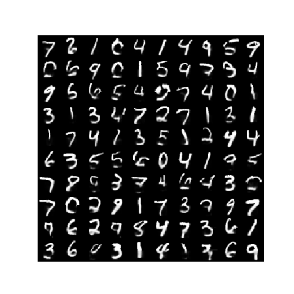

# cell.py
MANNCell implementation in One-shot learning paper
[[arxiv1606.06065](https://arxiv.org/abs/1605.06065)]

# MNIST_restore
* MNIST restore example with MANNCell  
1. Original Image  
  
2. Clipped_Image  
  
3. Restored_Image  
  
